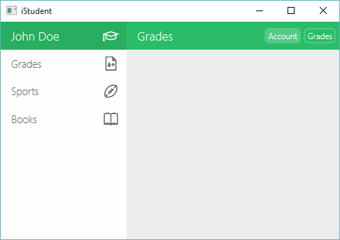
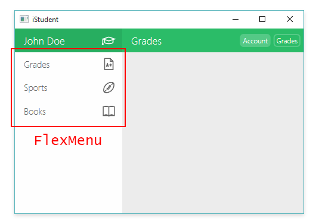
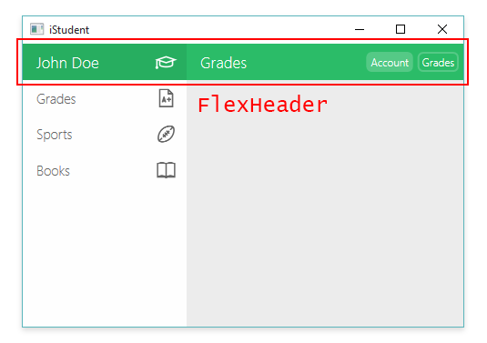
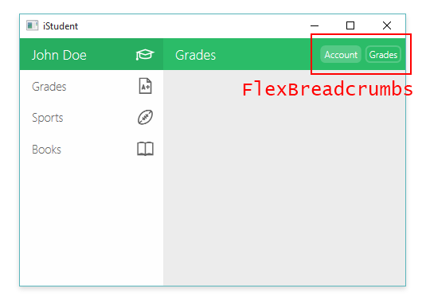

# FlexMenu



## Overview

* [Features](#features)
* [Usage](#usage)
    * [FlexMenu](#flexmenu)
    * [FlexHeader](#flexheader)
    * [FlexBreadcrumbs](#flexbreadcrumbs)

## Features

* Flexible *Menu*, *Header* & *Breadcrumbs*
* Binding support
* Fully animated

## Usage

Add a reference to the `FlexMenu` assembly and add the *XML namespace* below to your `Window`.

```xaml
<Window x:Class="MyProject.MyWindow"
        ...
        xmlns:fm="clr-namespace:FlexMenu.Controls;assembly=FlexMenu"
        Title="MyProject" Height="300" Width="300">
```

### FlexMenu



The *FlexMenu* is a simple vertical menu which supports one or more *FlexMenuItem*s as its content. 

A *FlexMenuItem* is a simple model which contains the following properties:

* **Text:** String *(Text to render)*
* **Icon:** ImageSource *(Icon to render)*

#### Method 1

**XAML**

```xaml
<fm:FlexMenu>
    <fm:FlexMenuItem Text="Grades" Icon="{StaticResource GradesImage}"/>
    <fm:FlexMenuItem Text="Sports" Icon="{StaticResource SportsImage}"/>
    <fm:FlexMenuItem Text="Books" Icon="{StaticResource BooksImage}"/>
</fm:FlexMenu>
```

#### Method 2 (Binding)

**XAML**

```xaml
<fm:FlexMenu ItemsSource="{Binding Items}"/>
```

**C#**

```cs
public ObservableCollection<FlexMenuItem> Items { get; set; }
```

```cs
var items = new FlexMenuItem[]
{
    new FlexMenuItem() { Text = "Grades", Icon = ... },
    new FlexMenuItem() { Text = "Sports", Icon = ... },
    new FlexMenuItem() { Text = "Books", Icon = ... }
};

Items = new ObservableCollection<FlexMenuItem>(items);
DataContext = this;
```

### FlexHeader



The *FlexHeader* is a simple horizontal header split in two sections: *Title* and *Subtitle*. The width of these sections can be set individually, as well as the background color. The *Title* section also features an *Icon* which is based off an *ImageSource*.

```xaml
<fm:FlexHeader Grid.Row="0" Grid.Column="0" Grid.ColumnSpan="2"
               Icon="{StaticResource StudentImage}"
               Title="John Doe" Subtitle="Grades"
               TitleWidth="135pt" SubtitleWidth="*"/>
```

### FlexBreadcrumbs



The *FlexBreadcrumbs* control is a simple horizontal list of breadcrumbs which can be embedded inside a *FlexHeader*.

A *FlexBreadcrumb* is a simple model which contains the following properties:

* **Text:** String *(Text to render)*
* **Boolean:** Active *(Style indicator)*

#### Method 1

```xaml
<fm:FlexHeader ...>
    <fm:FlexHeader.Content>
        <fm:FlexBreadcrumbs>
            <fm:FlexBreadcrumb Text="Account"/>
            <fm:FlexBreadcrumb Text="Grades" Active="True"/>
        </fm:FlexBreadcrumbs>
    </fm:FlexHeader.Content>
</fm:FlexHeader>
```

#### Method 2 (Binding)

**XAML**

```xaml
<fm:FlexHeader ...>
    <fm:FlexHeader.Content>
        <fm:FlexBreadcrumbs ItemsSource="{Binding Items}"/>
    </fm:FlexHeader.Content>
</fm:FlexHeader>
```

**C#**

```cs
public ObservableCollection<FlexBreadcrumb> Items { get; set; }
```

```cs
var items = new FlexBreadcrumb[]
{
    new FlexBreadcrumb() { Text = "Account" },
    new FlexBreadcrumb() { Text = "Grades", Active = true }
};

Items = new ObservableCollection<FlexBreadcrumb>(items);
DataContext = this;
```

Click [here](FlexMenu.Runnable/View/MainWindow.xaml) for an example implementation.
